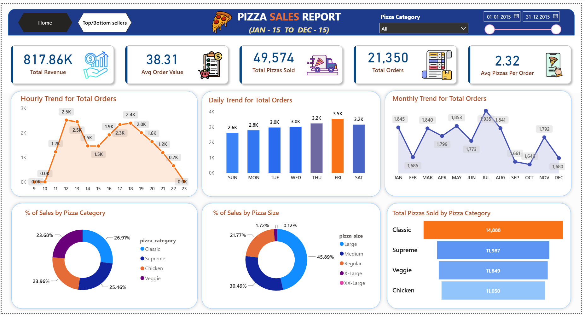
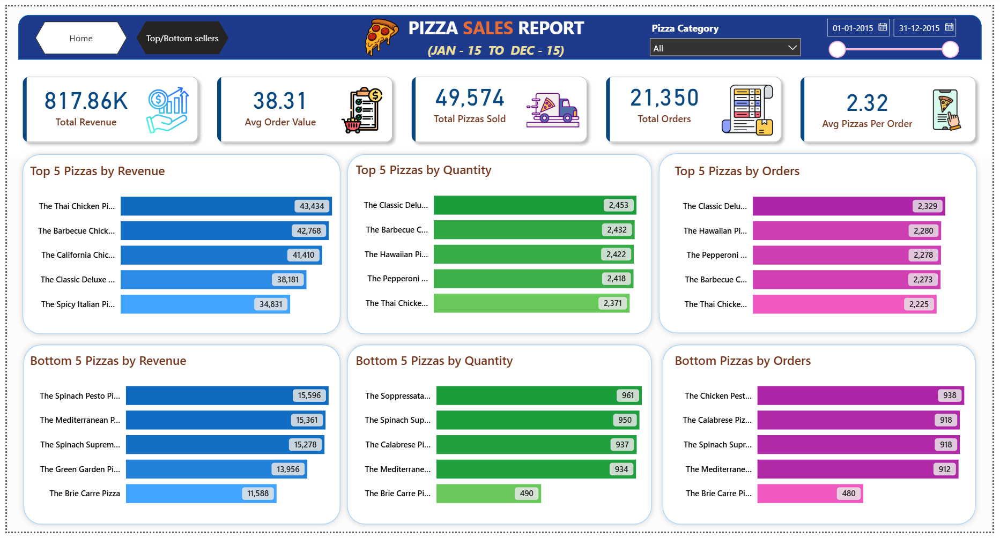

# 🍕 Pizza Sales Analysis Dashboard | SQL + Power BI

An end-to-end **Data Analytics Project** built using **SQL** and **Microsoft Power BI** to analyze pizza sales performance, customer ordering behavior, and product performance. This project demonstrates the complete analytics workflow—from SQL data exploration to Power BI dashboard development with Power Query transformations, DAX measures, and actionable business insights.

---

# 📌 Project Overview

The objective of this project is to analyze pizza sales data and provide business insights that help stakeholders understand sales trends, customer preferences, and product performance.

The project covers the complete analytics lifecycle:

- Data Collection
- SQL Data Analysis
- Data Cleaning using Power Query
- Data Modeling
- DAX Measure Creation
- Interactive Dashboard Development
- Business Insights & Recommendations

---

# 🛠️ Tools & Technologies

| Tool | Purpose |
|------|---------|
| SQL Server | Data Analysis |
| SSMS | SQL Query Execution |
| Microsoft Power BI | Dashboard Development |
| Power Query | Data Cleaning & Transformation |
| DAX | KPI Calculations |
| GitHub | Project Documentation |

---

# 📂 Repository Structure

```text
pizza-sales-analysis-sql-powerbi
│
├── README.md
│
├── Dataset
│   └── pizza_sales.csv
│
├── Project Files
│   ├── Pizza Sales Dashboard.pbix
│   └── SQL_Queries.sql
│
├── Dashboard Screenshots
│   ├── Dashboard_Page1.png
│   └── Dashboard_Page2.png
│
├── Documentation
│   ├── SQL_Queries_Analysis.pdf
│   ├── PowerBI_Dashboard_and_Business_Insights.pdf
│
└── LICENSE
```

---

# 📊 Dashboard Features

### Executive Dashboard

- Total Revenue
- Average Order Value
- Total Orders
- Total Pizzas Sold
- Average Pizzas Per Order
- Hourly Sales Trend
- Daily Sales Trend
- Monthly Sales Trend
- Sales by Pizza Category
- Sales by Pizza Size
- Total Pizzas Sold by Category

---

### Product Performance Dashboard

- Top 5 Pizzas by Revenue
- Top 5 Pizzas by Quantity
- Top 5 Pizzas by Orders
- Bottom 5 Pizzas by Revenue
- Bottom 5 Pizzas by Quantity
- Bottom 5 Pizzas by Orders

---

# 🧹 Power Query Transformations

The following data transformations were performed before building the dashboard:

- Replaced pizza size abbreviations
  - L → Large
  - M → Medium
  - R → Regular
  - XL → X-Large
  - XXL → XX-Large

- Inserted Day Name
- Inserted Day Number
- Inserted Month Name
- Inserted Month Number
- Inserted Hour column
- Renamed columns

---

# 📈 DAX Measures

The following DAX measures were created:

- Total Revenue
- Total Orders
- Total Pizzas Sold
- Average Order Value
- Average Pizzas Per Order
- Order Day
- Order Month

---

# 📌 Key Business Insights

### 📅 Sales Trends

- Friday records the highest customer orders.
- Weekends generate higher sales than weekdays.
- July is the best-performing month.
- January is the second-highest sales month.

---

### ⏰ Customer Ordering Pattern

- Peak ordering starts around **11 AM**.
- Lunch hours (12 PM–1 PM) receive the highest number of orders.
- Another peak occurs during **5 PM–6 PM**.
- Orders decline significantly after **8 PM**.

---

### 🍕 Product Performance

- Classic Pizza category generates the highest revenue.
- Large pizzas contribute the highest percentage of total sales.
- The Thai Chicken Pizza generates the highest revenue.
- The Classic Deluxe Pizza records the highest quantity sold and the highest number of orders.
- The Brie Carre Pizza is the lowest-performing product.

---

# 📈 Business Recommendations

- Increase staffing during lunch and evening peak hours.
- Maintain higher inventory during weekends.
- Promote large-size pizzas to maximize revenue.
- Launch promotional campaigns during low-performing months.
- Improve or replace low-performing pizza varieties.

---

# 📷 Dashboard Preview

## Executive Dashboard



---

## Product Performance Dashboard



---

# 📄 Documentation

This repository also contains:

- SQL Queries Analysis
- Power BI Dashboard Documentation & Business Insights

---

# 🎯 Skills Demonstrated

- SQL
- Data Cleaning
- Power Query
- Data Modeling
- DAX
- Data Visualization
- Dashboard Design
- Business Analysis
- KPI Development
- Business Storytelling
- GitHub Documentation

---

# 🚀 Future Enhancements

- Implement Row-Level Security (RLS)
- Publish dashboard to Power BI Service
- Enable automated data refresh
- Add customer segmentation analysis
- Build forecasting using Power BI

---

# 👨‍💻 Author

**Nikhil Ramagiri**

Aspiring Data Analyst | SQL | Power BI | Excel | Python

📧 Email:ramagirin45@gmail.com

🔗 LinkedIn: www.linkedin.com/in/nikhil-ramagiri-21b2a324a

🔗 GitHub: https://github.com/RamagiriNikhil

---

## ⭐ If you found this project useful, consider giving this repository a Star!
